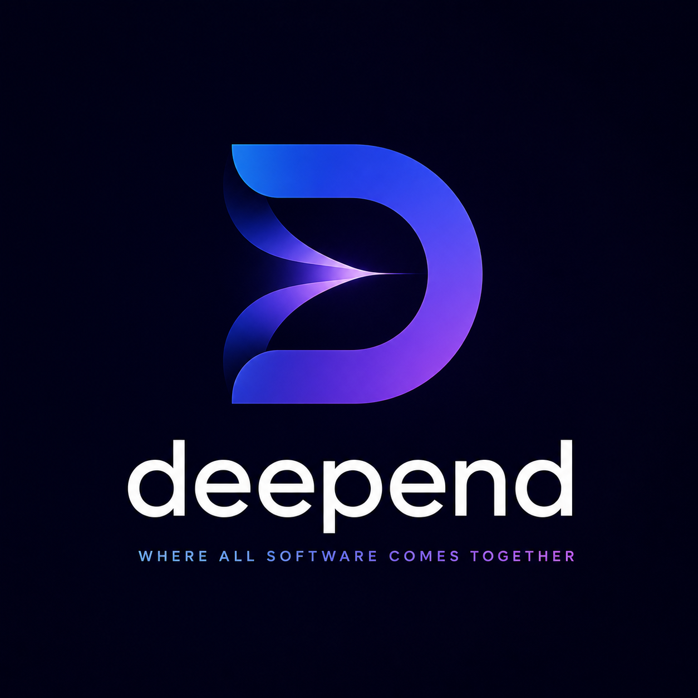

# Deepend

**Where everything comes together.**

The only software you'll ever need.
A single offline app that bundles every developer utility you reach for —
JSON, text, PDF, API, and image tooling — into one window, on your machine.

---

## Install

Grab the installer for your OS from the [latest release](https://github.com/deepen-stha/deepend-releases/releases/latest).

| OS                       | Download                              | How to install                                               |
|--------------------------|---------------------------------------|--------------------------------------------------------------|
| **Windows 10/11**        | `Deepend_*_x64-setup.exe` (recommended) or `.msi` | Double-click → "More info → Run anyway" past SmartScreen → install. |
| **macOS** Apple Silicon  | `Deepend_*_aarch64.dmg`               | Open the `.dmg`, drag to Applications. First launch: right-click → Open. |
| **macOS** Intel          | `Deepend_*_x64.dmg`                   | Same as above.                                               |
| **Linux** Debian/Ubuntu  | `deepend_*_amd64.deb`                 | `sudo apt install ./deepend_*.deb`                           |
| **Linux** Any distro     | `deepend_*_amd64.AppImage`            | `chmod +x deepend_*.AppImage && ./deepend_*.AppImage`        |

> **First-launch warnings are expected.** Deepend isn't yet code-signed — Windows shows a SmartScreen prompt, macOS asks you to right-click → Open the first time. Both are one-click bypasses. Linux has no warning. We're saving for the certs.

---

## What's inside

Five studios, **43 tools**, all offline, all instant.

### 🟦 JSON Studio — *13 tools*
Format · Tree explorer · Repair · Semantic diff · Convert (JSON ↔ YAML/CSV/XML) · JSONPath query · Redactor · Type generator (TS / Go / Rust) · JWT decoder · Stats · Mock generator · JSON → Table (Markdown / HTML / SQL) · RFC 6902 patch

### 🟦 Text Studio — *11 tools*
Hash (MD5 / SHA-1/256/384/512) · Diff · Stats · Readability (Flesch / FK / Fog / SMOG / Coleman-Liau / ARI) · Frequency (n-grams) · Case forge (16 transforms) · Line ops · Encode hub (Base64 / URL / hex / binary / unicode / ROT13) · Scrub · Regex bench · Random gen (passwords / UUIDs / lorem)

### 🟦 PDF Toolkit — *7 tools*
Merge · Split · Compress · Protect (encrypt with permissions) · Sign · Organize (drag-reorder pages) · PDF → Image (PNG / JPG / WebP)

### 🟦 API Studio — *6 tools*
Request · cURL converter · Code generator (cURL / fetch / axios / requests / httpx / Go / Node) · Status codes reference · Headers reference · Load test (up to 10,000 concurrent requests, p50/p95/p99 latency)

### 🟦 PixelForge — *6 tools*
Full image editor (crop / rotate / filters / adjust / export) · Resize · Format converter · Compress · Color picker · Metadata (with EXIF inspector)

---

## Why Deepend?

| Problem                                                    | Deepend's answer                                                                                  |
|------------------------------------------------------------|---------------------------------------------------------------------------------------------------|
| "I have 12 different web apps for these utilities."        | One installer, one window, every tool one keystroke (`Ctrl+K`) away.                              |
| "Free PDF tools always upload my documents somewhere."     | Everything runs in your machine's memory. No upload, no server, no telemetry.                     |
| "Postman wants $200/seat/year."                            | API Studio is free, no account, no sync server, plus Postman v2.1 collection import/export.       |
| "Electron apps eat 400 MB of RAM."                         | Built on Tauri 2 — ~10–15 MB installer, ~80 MB RAM, native webview instead of bundled Chromium.   |
| "Closed-source tools train models on my data."             | MIT-licensed. No analytics, no tracking, no phone-home. Inspect the network panel; you'll see.    |

---

## What ships in the installer

- The compiled native binary (~10–15 MB)
- Bundled HTML / JS / CSS (the React frontend, baked in)
- Platform icons
- **Nothing else.** No Node runtime, no embedded Chromium, no telemetry, no network calls. The system's WebView (Edge WebView2 on Windows, WKWebView on macOS, WebKitGTK on Linux) renders the UI.

---

## Privacy & security

- **100% offline by default.** The only outbound HTTP requests come from tools where the user explicitly types a URL and clicks "Send" (API Studio's Request and Load Test tools). Everything else — including PDF processing, image editing, encryption, and hash computation — runs entirely on your device.
- **No accounts.** Nothing to sign up for. No cloud component.
- **No telemetry.** Deepend never reports usage data, errors, or any other information back to any server.
- **Strict CSP.** The webview runs under `default-src 'self'` with no `eval` and no remote scripts.
- **Sandboxed IPC.** Filesystem and OS access happen through an explicit allowlist of Rust commands.

---

## Versions

See the [Releases page](https://github.com/deepen-stha/deepend-releases/releases) for every published build, change notes, and direct download links.

The auto-updater is not yet wired up in v0.1.x — for now, check this page for new releases.

---

## License

[MIT](https://opensource.org/licenses/MIT). Do whatever you want with it.

The source code lives in a separate private repository. This repository is the public mirror for installer downloads.

---

Built by [Deepen Shrestha](https://github.com/deepen-stha) ·
[Report a bug](https://github.com/deepen-stha/deepend-releases/issues) ·
[Latest release](https://github.com/deepen-stha/deepend-releases/releases/latest)

